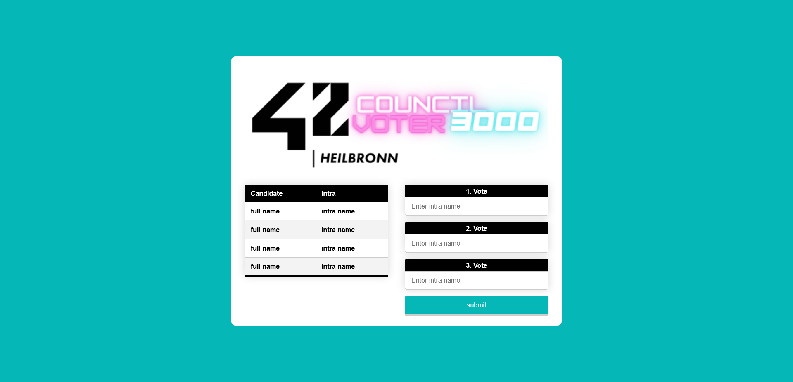

## This Docker container is build to run on a server and provide an easy to use interface for every student to vote for their councilors.

Build the docker container with:
```
make build
```
For starting the server:
```
make all
```

## The Team
[42 Heilbronn](https://www.42heilbronn.de/en/) students:
[Alex](https://github.com/42akurz), [Jeremie](https://github.com/JeremieSiller), [Kevin](https://github.com/khirsig), [Robin](https://github.com/Radel-24) 

## Screenshots





For setting up your own election system, delete ```./docker_django/HN_poll/db.sqlite3```.
Then change directory to ```./docker_django/HN_poll```, in your terminal type ```python3 manage.py migrate```. 
Create a new admin account with ```python3 manage.py createsuperuser```. Go to the ```website url /admin```and enter your admin credentials.
In the users table add a second user next to your admin with the name ```voter``` and the password given in the ```./docker_django/secrets.env```. After that you can set up all candidates in the candidates table.
